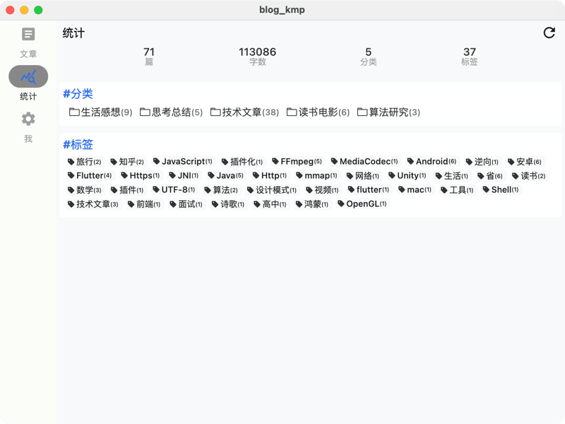

# Blog-KMP

A KMP app built based on the api provided by my [personal blog](https://julis.wang)

## Libraries used

- 🧩 [Compose Multiplatform](https://github.com/JetBrains/compose-multiplatform); for shared UI
- 🌐 [Ktor](https://github.com/ktorio/ktor); for Injection
- 🌃 [Coil](https://github.com/coil-kt/coil); for image loading
- 🖥️ [Webview](https://github.com/KevinnZou/compose-webview-multiplatform); for web url loading
- 💉 [Koin](https://github.com/InsertKoinIO/koin); for Injection
- 📦 [Kotlinx Serialization](https://github.com/Kotlin/kotlinx.serialization); for content negotiation
- 🕰️ [Kotlinx Datetime](https://github.com/Kotlin/kotlinx-datetime); for datetime
- 🗃️ [Datastore](https://developer.android.com/topic/libraries/architecture/datastore); for storage

## Main Features

- Blog
    - Blog post list
    - Blog post details
- Stats
    - Blog tag statistics
    - Blog classification statistics
    - Blog word count
    - Recommended TV Series
- Mine
    - Dark mode switch
    - About info

## Showcase

### Android

      
      
      

#### Dark Mode

      
      
      

### iOS

      
      
      

### Desktop

      
      
      

## Before running!

- check your system with [KDoctor](https://github.com/Kotlin/kdoctor)
- install JDK 17 or higher on your machine
- add `local.properties` file to the project root and set a path to Android SDK there

## Run instructions

### Android

To run the application on Android device/emulator:

- open the project in Android Studio and run the imported android run configuration

To build the application bundle:

- run `./gradlew :composeApp:assembleDebug`
- find `.apk` file in `composeApp/build/outputs/apk/debug/composeApp-debug.apk`

### iOS

To run the application on an iPhone device/simulator:

- Open `iosApp/iosApp.xcproject` in Xcode and run standard configuration
- Or
  use [Kotlin Multiplatform Mobile plugin](https://plugins.jetbrains.com/plugin/14936-kotlin-multiplatform-mobile)
  for Android Studio

### Desktop

- Run the desktop application: `./gradlew :composeApp:run`

